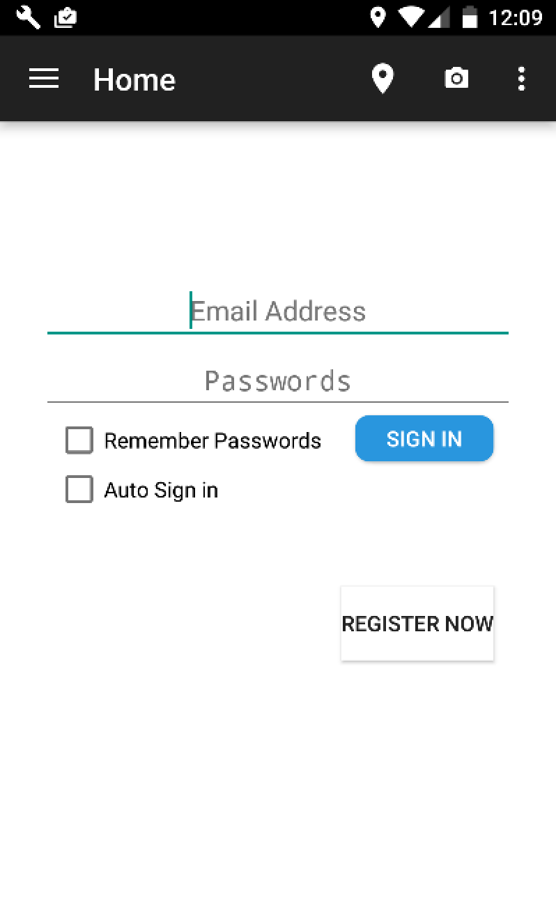

# Weather-Life Demonstration
**Weather-Life Mobile Application** develop functions such as

    •regular weather pushing and notifications
    •sharing real-time photos with other users to advise weather conditions in different locations
    •finding nearby activities according to current weather conditions
    
**Features**  

    •using instant chat to require destination’s weather conditions
    •calculating footsteps using sensor of mobiles 

**Weather-Life Web Server** utilizes Google Firebase

# Screenshots of Mobile Application
#### • `App intial screen`

#### • `Weather forecast, activity pushing (based on current weather) and trend graph screen`

#### • `App location permission`

#### • `App navigation (log off, log in status)`

#### • `Chat and request weather condition screen`

#### • `Download image from chat`

#### • `Take photo of streetview or choose from gallery`

#### • `Streetview been posted in chat`

#### • `Travel and nearby activity helper`

#### • `Cloth helper (based on current temperature)`

#### • `Login`

#### • `Register`

#### • `User profile & Location Preferences (automaticly record user footsteps and streetview contributions)`

#### • `Setting`

# Credits
I used [MPAndroidChart](https://github.com/PhilJay/MPAndroidChart) library by Philipp Jahoda as a Line Chart of temperature for development. 

# Acknowledgements
UI images are from [google Image](https://images.google.com/) and icons are from [Material icons](https://design.google.com/icons/)

# License
   Copyright {2016} {Huashun Li, Lawrence Zhou}
   
   Licensed under the Apache License, Version 2.0 (the "License");
   you may not use this file except in compliance with the License.
   You may obtain a copy of the License at
   
       http://www.apache.org/licenses/LICENSE-2.0
       
   Unless required by applicable law or agreed to in writing, software
   distributed under the License is distributed on an "AS IS" BASIS,
   WITHOUT WARRANTIES OR CONDITIONS OF ANY KIND, either express or implied.
   See the License for the specific language governing permissions and
   limitations under the License.
